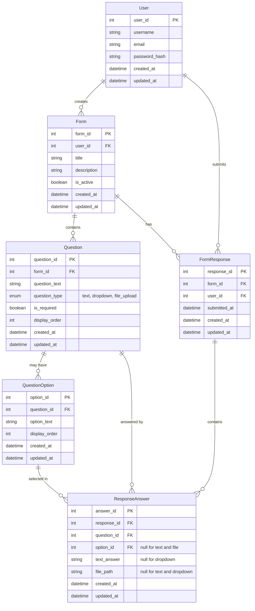

# Design

this document covers the design of this system

## Technical Decision
- Frontend 
    - NextJS - modern fullstack react based framework
        - Pros
            - ReactJS which I am familar with
            - leverage SSR
            - fullstack framework to make project easy to deploy with 1 command on vercel
        - Cons
            - requires tweaking for best performance
- backend
    - NextJS - API Route
        - Pros
            - Same project API Handling / filtering
            - reduce overhead of TypeSharing and can have unified validation
            - Restful interface
        - Cons
            - Handler are not always running they run on demand which may hinders performance
            - Requires tweaking to do non-restful API call
- database
    - sqlite
        - pros
            - light weight
            - able to bundle and run locally with high performance
        - cons 
            - no decoupling, once fail, the whole server fail
            - no replication can be configured
    - prisma ORM
        - pros
            - one schema works everywhere allow later enhancement or migration
            - handles database migration
        - cons
            - remote script called for migration
- filestorage
    - local file store
        - pros
            - simple
            - able to bundle and run locally
        - cons
            - no backup
            - security overhead
- CI/CD
    - Vercel
- testing
    - cypress - frontend end-to-end test
    - jest - unit test for critical functions

## Enhancement from this architecture
- Authentication and Authorization
- decouple frontend and backend
    - backend can be serverless by AWS Lambda if speed is not the rate limiting factor
- database should consider using postgres
- filestorage should consider using AWS S3
- leverage k8s or Docker Swarm to orchestrate every different services.
- id can uses snowflakeId for roughly order by time and without int overflow problem
- currently the Docker file is quite large it does not go through any optimization on minimization.

## ERD Design

## Workflow

### 1. landing page 
- allow any user to list form and create account if not already created
    - list form
### 2. register page
- allow any user to register
### 3.login page
- allow any user to login
### 4.loggedin home page
- allow logged in user to view forms and goto create forms
    - list form
        - if form is created by user
            - Edit Button
            - Delete Button (with prompt) delete will delete cascade (Questions, Response Answer, FormResponse, Question Option)
        - else 
            - Survey button fill form page
### 5. create form page
- allow logged in user toCreate Form /Edit Formpage
- allow logged in user to create forms
    - create forms
    - create questions
    - create questions options
    - update form
    - update questions
    - update questions options
    - delete form
    - delete questions (display Order = -1)
    - delete questions options (display Order = -1)
### 6. fill form page
- allow logged in user to submit answer
    - show form
    - list all questions
    - list questions options
    - create FormResponse
    - create FormResponse Answer
### 7. formResponsePage
- allowed creator to view response
    - show form
    - list FormResponse
    - list FormResponse Answer
- should show in table format/questions and list format
- allow export to csv/ print as PDF

## libs considering
### most likely
- nextjs - framework
- zod - form validation
- useSWR - for DatabaseQuery
- bcrypt - for password encoding
- prisma - orm
- sqlite - for sqlite to works with prisma
- shadecn - frontend component library with form handling
- tailwindcss - all time favourite frontend styling

### optional
- envalid - validation of .env
- @eklabdev/bling - decorators for services house keeping
